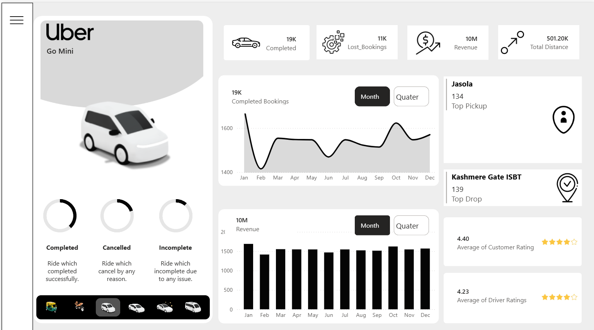

# 🚖 Uber Dashboard (Power BI)

## 📌 Overview
This project is an interactive Power BI dashboard that analyzes Uber ride booking data.

## Dashboard Preview

## Features

- Total Completed Bookings
- Lost Bookings
- Revenue Analysis
- Total Distance
- Monthly & Quarterly Trends
- Top Pickup Locations
- Top Drop Locations
- Customer Ratings
- Driver Ratings
- Vehicle Type Analysis

## KPIs

- ✅ Completed Bookings: 19K
- ❌ Lost Bookings: 11K
- 💰 Revenue: 10M
- 📍 Total Distance: 501.20K

## Tools Used

- Power BI
- Excel
- DAX
- Power Query

## Files

| File | Description |
|------|-------------|
| Uber Dashboard.pbix | Power BI Report |
| dashboard.png | Dashboard Screenshot |
| README.md | Documentation |

## Author

**Virang Raje**

GitHub: https://github.com/rajevirang28

LinkedIn: https://www.linkedin.com/in/virang-raje-716882285